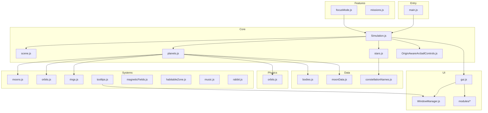
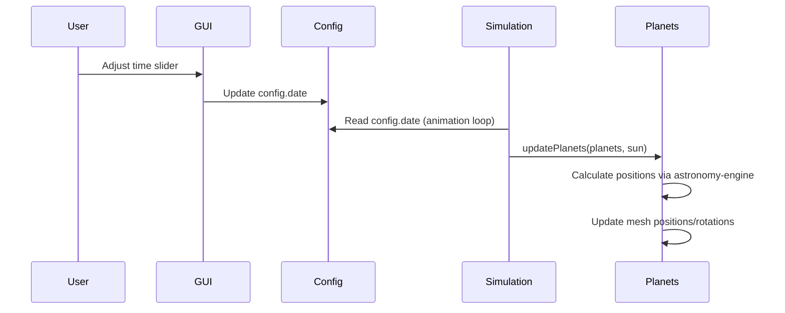

# White Rabbit Architecture

This document provides a detailed overview of the White Rabbit solar system simulator's architecture for contributors and AI assistants.

## High-Level Overview



## Directory Structure

```
src/
├── main.js              # Entry point, initializes Simulation
├── config.js            # Global configuration state (single source of truth)
│
├── core/                # Core rendering and scene management
│   ├── Simulation.js    # Main orchestrator class (animation loop, initialization)
│   ├── scene.js         # Three.js scene, camera, renderer, lighting setup
│   ├── planets.js       # Planet/dwarf planet creation/updates
│   └── stars.js         # Starfield, constellations, asterisms
│
├── controls/            # Camera controls
│   └── OriginAwareArcballControls.js # Custom controls handling floating origin (Proxy Camera)
│
├── data/                # Static data definitions (no logic)
│   ├── bodies.js        # Planet properties (radius, period, texture, etc.)
│   ├── moonData.js      # Moon definitions by category
│   └── constellationNames.js  # Constellation abbreviation mappings
│
├── physics/             # Pure math functions (no Three.js dependencies)
│   └── orbits.js        # Keplerian orbit calculations
│
├── systems/             # Self-contained visual/physics subsystems
│   ├── moons.js         # Moon creation and position updates
│   ├── orbits.js        # Orbit line visualization
│   ├── rings.js         # Planetary ring creation
│   ├── tooltips.js      # Interactive tooltip/info window system
│   ├── magneticFields.js # Magnetic field visualizations
│   ├── habitableZone.js # Habitable zone ring
│   ├── music.js         # Background music system
│   ├── rabbit.js        # Intro animation
│   ├── coordinates.js   # Coordinate system transformations
│   ├── relativeOrbits.js # Moon orbit lines relative to planets
│   └── zodiacSigns.js   # Zodiac sign sprites
│
├── features/            # User-facing application features
│   ├── focusMode.js     # Camera tracking and focus on objects
│   ├── missions.js      # Space mission trajectory visualization
│   └── events.js        # Global event system
│
├── ui/                  # User interface
│   ├── gui.js           # Main GUI orchestrator (lil-gui setup)
│   ├── WindowManager.js # Draggable window management
│   ├── MenuDock.js      # Bottom dock UI
│   └── modules/         # Individual UI modules
│       ├── TabbedWindow.js  # Tabbed window component
│       ├── scale.js     # Scale controls
│       ├── time.js      # Time/date controls
│       ├── visual.js    # Visual toggles (orbits, overlays, etc.)
│       ├── missions.js  # Mission toggles
│       ├── sound.js     # Music controls
│       ├── find.js      # Object search window
│       └── ...
│
├── materials/           # Custom Three.js materials
│   ├── MaterialFactory.js # Material generation and legacy origin patching
│   └── SunMaterial.js   # Sun shader material
│
├── managers/            # Resource managers
│   └── TextureManager.js # Texture loading and caching
│
├── utils/               # Utility functions
│   ├── logger.js        # Debug logging
│   └── Octree.js        # Spatial data structure for star queries
│
├── api/                 # External API integrations
│   └── nasa.js          # NASA API for textures (not currently used)
```

## Key Design Principles

### 1. Separation of Concerns

| Directory | Purpose | Dependencies |
|-----------|---------|--------------|
| `physics/` | Pure math calculations | None (no Three.js) |
| `data/` | Static definitions | None |
| `core/` | Three.js scene graph | physics/, data/ |
| `systems/` | Visual subsystems | core/, config |
| `features/` | User features | systems/, core/ |
| `ui/` | Interface | config, features/ |

### 2. Single Source of Truth

- **`config.js`**: All global state lives here
- **`config.date`**: Current simulation time
- **`config.simulationSpeed`**: Time multiplier

### 3. Modular UI

Each file in `ui/modules/` is a self-contained UI section that:
- Exports a `setup*Folder(gui, config)` function
- Returns a lil-gui folder
- Is imported and orchestrated by `gui.js`

## Data Flow



## Coordinate System

The simulation uses **Equatorial Coordinates (J2000 epoch)**:

- **X-Axis**: Vernal Equinox (0h Right Ascension)
- **Y-Axis**: North Celestial Pole (in Three.js, this is "up")
- **Z-Axis**: Perpendicular (completes right-handed system)

See [COORDINATE_SYSTEMS.md](./COORDINATE_SYSTEMS.md) for detailed transformation logic.

## Adding New Features

### New Planet/Moon
1. Add data to `src/data/bodies.js` or `src/data/moonData.js`
2. Add texture to `public/assets/textures/`
3. Run `npm run dev` to test

### New UI Control
1. Create `src/ui/modules/myfeature.js`
2. Export `setupMyFeatureFolder(gui, config)`
3. Import in `src/ui/gui.js`

### New Visual System
1. Create `src/systems/mysystem.js`
2. Export create/update functions
3. Call from `Simulation.js` init and animation loop

## Key Files Quick Reference

| File | Purpose |
|------|---------|
| `src/config.js` | Global state, constants |
| `src/core/Simulation.js` | Main class, animation loop |
| `src/core/planets.js` | Planet creation/updates |
| `src/systems/tooltips.js` | Object info display |
| `src/ui/gui.js` | UI orchestration |
| `src/data/bodies.js` | Planet data |
